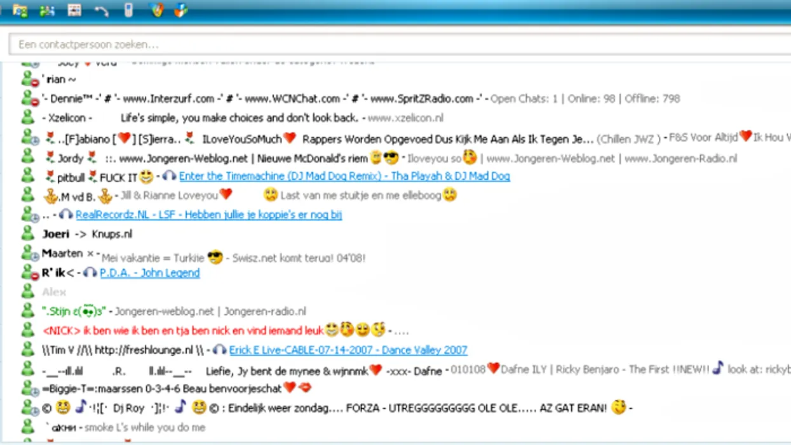

# El día que dejé de scrollear
> o mejor dicho, el día que dejé de [*doomscrollear*](asf)

Podría decir que llevo 20 de mis 29 años conectado irremediablemente a internet. Partiendo con la conexión DSL en la que se cortaba el internet sí es que alguien en la casa descolgaba el telefono...

En ese tiempo, por allá por el 2004, mi tiempo en internet lo ocupaba jugando alguno que otro juego [flash](https://en.wikipedia.org/wiki/Adobe_Flash_Player) en paginas de dudosa procedencia y en las que pasaba horas y horas recorriendo página tras página en busca de nuevos juegos como también jugándolos.

En aquel tiempo, si los juegos de internet ya no eran suficiente, buscaba en mi repisa algún CD-ROM que servía de entretenimiento para la tarde. Imposible olvidar ese tiempo en *Motocross Madness 2*, *Crimson Skies*, *Age of Empires*, *Empire Earth* o el mítico *Warcraft III: Reign of Chaos*.

A medida que pasaron los años y el internet se empezó a masificar, el nuevo pasatiempo se convirtió en [Messenger](https://en.wikipedia.org/wiki/MSN_Messenger), sí, el de MSN, no el de ~~Facebook~~ Meta.

Hablando de Meta, recuerdo perfectamente una tarde del verano 2008/2009 en Santaigo cuando en la radio del auto escuche mencionar el crecimiento explosivo que estaba teniendo esta nueva "red social" llamada Facebook y cómo yo, completamente emocionado, le contaba a mi mamá que ya tenía una cuenta hace unos meses. En algún intento de querer decir: "Mírame!! Soy Vanguardista!".

En un principio, mi uso de Facebook fué muy en linea con lo que hacía hace años: jugar. Ahora la principal diferencia es que podía compartir el progreso entre mis amigos.

Al igual como ocurría en las páginas de juegos *flash*, en donde la lista de juegos nuevos diarios se acababa, en Facebook el *feed* tenía un fin y una vez alcanzado, solo quedaba ver publicaciones de amigos de los días anteriores.

Todos sabemos que este *feed* finito fue transformándose gradualmente en el *feed* interminable y finalmente en ese *feed* caótico, en donde se genera un infinito nuevo por cada toque del F5.

En un inicio y por varios años el computador era el único medio por el cual *scrolleaba* constantemente, a pesar de tener acceso a teléfonos móviles desde muy pequeño, estos erán mas bien *dumb* en vez de *smart* y no había mucho más que hacer que jugar con la calculadora y sacar fotos en 360p.

El primer *smartphone* con el cual sentí que todo lo anterior había quedado obsoleto fue el iPhone 4S. De aquí en adelante, mi tiempo de *scroll* se dividía teléfono/computador dependiendo de lo que tuviera cerca, pero con el paso de los años mi teléfono empezó a pasar cada vez mas tiempo en mi mano.

Mi tiempo en la universidad comenzó el 2014, casí al mismo tiempo en que las [FAANG](https://www.investopedia.com/terms/f/faang-stocks.asp) agarraron vuelo y todo el mundo pareciera que empezó a girar en torno a redes sociales, Netflix, YouTube, Instagram...

Facebook en ese entonces y durante gran parte de mi paso por la universidad fué el lugar de-facto en donde encontrar información acerca de eventos univesitarios, cursos, fiestas, memes, etc. En más de alguna ocasión me encontré *scrolleando* Facebook durante el transcurso de alguna clase.

Lo curioso es que en ningún minuto sentí que estaba solo. Diría que en cada fila de la sala, exceptuando quizás las de adelante, y durante toda la clase había alguién viendo su telefono. Quizás no todos estaban en Facebook, Intagram, Whatsapp o Snapchat, pero la mayoría sí.

Recuerdo que durante este tiempo esta situación no la encontraba del todo normal, pero si aceptada completamente. En mis viajes de ida y vuelta en metro a la universidad empecé a contar cuantas de las 10 personas más cercanas a mi estaban usando el teléfono: el número siempre rondaba entre 5 y 7 personas cada vez que recordaba contar.