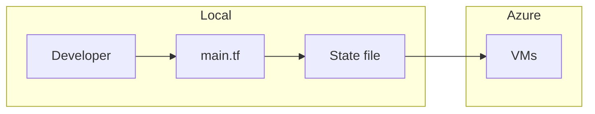
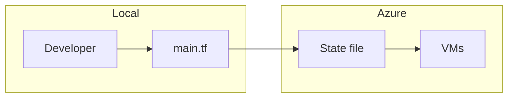
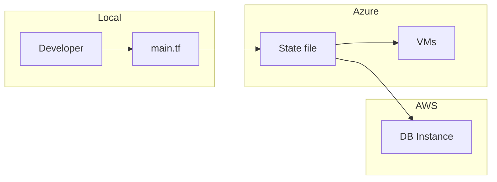
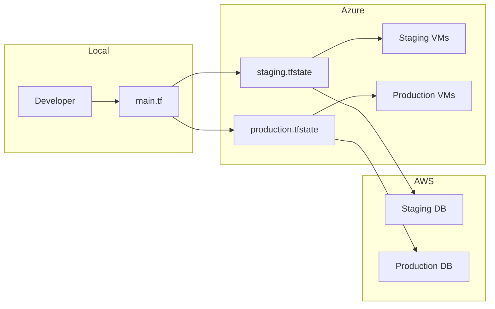

A lot of new projects tend to start with a naive team looking to improve the way infrastructure is handled. So after discovering Terraform they start doing something like this:



After 2 days of merge-conflicts because of the local state file tracked in Git…. The team realises that it could be wise to use a remote backend to store the state of the infrastructure



Great! Now everyone on the team works with a single copy of the infrastructure definition. Next day comes the PM and forces the team to use AWS RDS because that’s the way to use databases in the cloud, right?

Sure enough, the team updates the configuration to include the AWS provider and define a “aws_db_instance” resource



Cool! Now the team is **multicloud**!. Next week, they realise that to start 🚀 shipping fast 🚀 they need to test the code in a staging environment that should be a clone of the production environment. Sure! said the team lead: “let’s use workspaces!” (`tf workspace new production && tf workspace new staging`)



Cool! Now the team is **multi-environment** and **multi-cloud**. Sadly after 2 weeks, the budget went through the sky 💸, project was shut down and the team was forced to do:

```bash
terraform workspace select staging
terraform destroy -auto-approve

terraform workspace select production
terraform destroy -auto-approve
```

Good bye multi-cloud and multi-environment you were good, but expensive...


Disclaimer: This is a experimental series of short blog posts aimed to be in the 2-3 minutes reading range covering cloud, software or miscellaneous topics.
